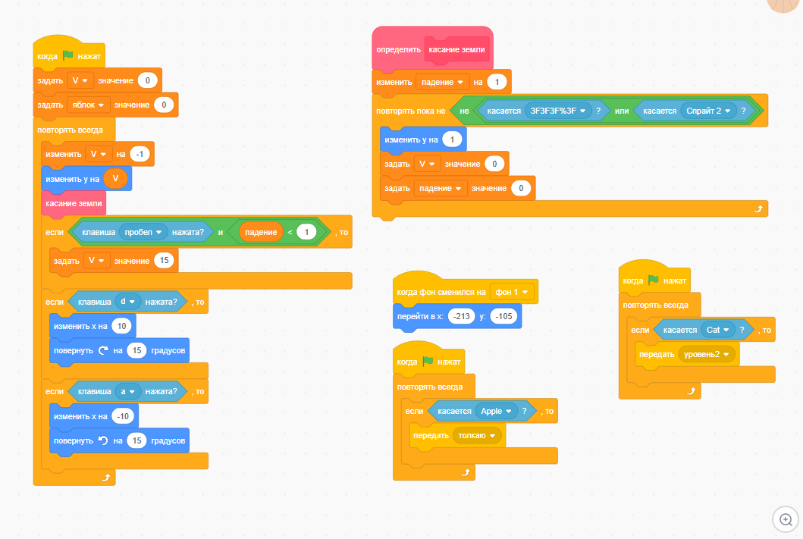
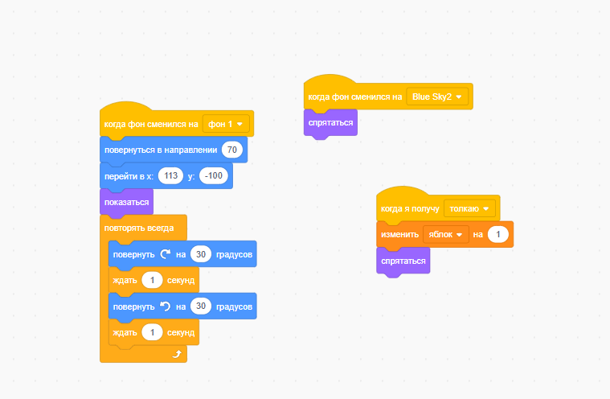

# 02_lab020108_Scratch: Визуальное программирование в Scratch

## Описание проекта
Данный проект содержит реализацию интерактивной игры, разработанной в среде визуального программирования Scratch. В рамках лабораторной работы создана игра с тремя активными спрайтами и системой уровней, демонстрирующая основные принципы визуального программирования.

## Описание игры
Игра представляет собой платформер, где игрок управляет красным мячом, собирает яблоки и избегает движущегося куба. При достижении конца локации происходит переход на следующий уровень.

## Реализованные спрайты

### Спрайт 1: Красный мяч (управляемый персонаж)
- **Роль:** Главный персонаж, управляемый игроком
- **Управление:** Стрелки клавиатуры (вверх, вниз, влево, вправо)
- **Функциональность:** Прыжки, движение по платформам, сбор яблок

### Спрайт 2: Куб (автономный персонаж)
- **Роль:** Препятствие, движущееся независимо от игрока
- **Поведение:** Перемещение между заданными точками по траектории
- **Особенности:** Постоянное движение, создает сложность для игрока

### Спрайт 3: Яблоко (интерактивный объект)
- **Роль:** Собираемый предмет
- **Поведение:** Исчезает при касании с мячом, появляется в новых местах
- **Влияние:** Определяет прогресс прохождения уровня

## Система уровней
Реализована система из 2 уровней через смену фонов:

**Уровень 1: Начальный уровень**
- Простая платформа
- Медленно движущийся куб

**Уровень 2: Продвинутый уровень**
- Сложная структура платформ
- 1 яблоко для сбора

## Требования
- Браузер с поддержкой Flash или Scratch Desktop версии 3.0 или выше

## Установка и запуск

### 1. Онлайн версия
```bash
# Перейдите на официальный сайт Scratch
https://scratch.mit.edu/

# Загрузите файл проекта "Проект Scratch.sb3"
# Нажмите "Файл" → "Загрузить с компьютера"
```
### 2. Оффлайн версия (Scratch Desktop)
```bash
# Скачайте Scratch Desktop с официального сайта
https://scratch.mit.edu/download

# Установите приложение
# Откройте файл "Проект Scratch.sb3"
```
## Управление игрой
- **Стрелка влево: Движение влево**
- Стрелка вправо: Движение вправо**
- **Стрелка вверх: Прыжок**

## Принципы визуального программирования, использованные в проекте
1. **Блочное программирование - использование готовых блоков для создания логики**
2. **Событийное программирование - реакция на действия пользователя и системные события**
3. **Объектно-ориентированный подход - каждый спрайт имеет собственную логику поведения**
4. **Модульность - разделение функциональности между различными спрайтами**
5. **Взаимодействие через сообщения - система вещания (broadcast) для координации действий**

##Тестирование
Для проверки корректности работы выполните:
1. Тестирование управления:
    - Проверьте отклик на нажатие стрелок клавиатуры
    - Убедитесь, что мяч перемещается плавно и реагирует на препятствия

2. Тестирование взаимодействий:
    - Проверьте сбор яблок при касании
    - Убедитесь, что куб движется независимо от игрока

3. Тестирование системы уровней:
    - Проверьте переход между уровнями
    - Убедитесь в корректной смене фона и сбросе позиций

## Примеры скриншотов реализации

*Логика управления красным мячом*


*Автономное движение куба*



*Механика сбора яблок*



*Логика перехода между уровнями*

[Система уровней](./код_смены_фона.png)

# 02_lab020108_R