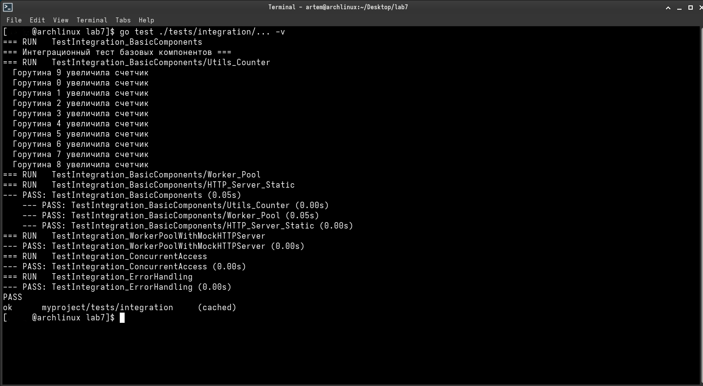
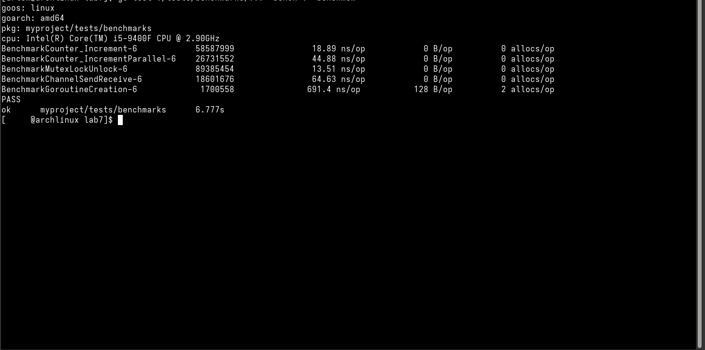
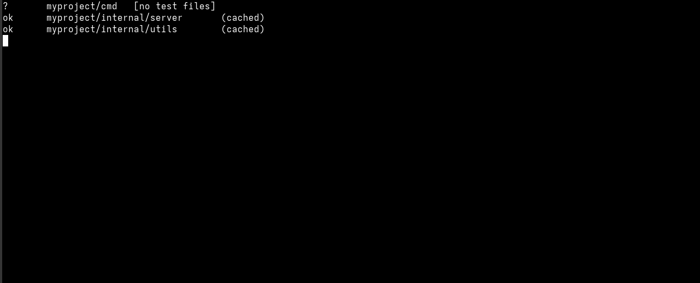
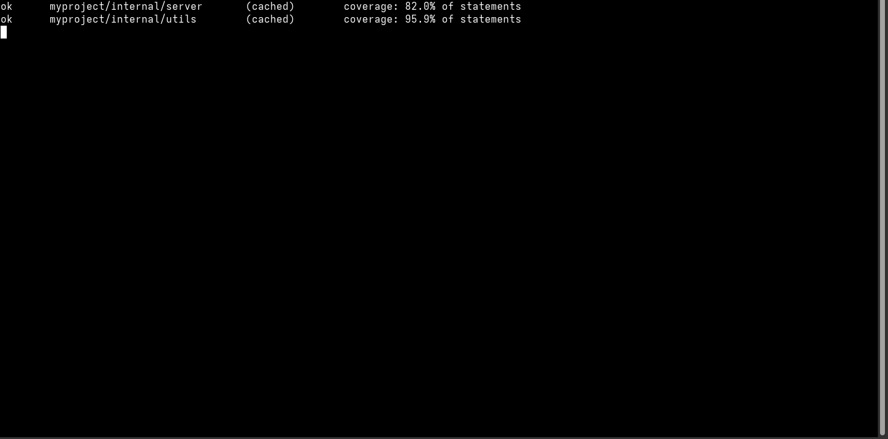

# **Отчет по лабораторной работе**  
**Тема:** Асинхронное программирование в Go с использованием горутин, каналов и паттернов параллельного программирования  

## Сведения о студенте  
**Дата:** [2025-12-08]  
**Семестр:** [2 курс, 3 семестр]  
**Группа:** [Пин-б-о-24-1(2)]  
**Дисциплина:** [Технологие програмирования]  
**Студент:** [Иванников Сергей Сергеевич]  

---

## Цель работы
Освоить практическое применение горутин, каналов и паттернов параллельного программирования в Go для создания высокопроизводительных асинхронных приложений, а также освоить методики тестирования конкурентного кода.

## Задачи работы
1. Изучить базовые механизмы конкурентности в Go: горутины и каналы
2. Реализовать паттерны параллельного программирования: Worker Pool, Producer-Consumer, Fan-out/Fan-in
3. Создать многопоточный HTTP-сервер с поддержкой graceful shutdown
4. Освоить методики тестирования асинхронного кода
5. Изучить использование детектора гонок (race detector)

---

## Теоретическая часть

### Основные понятия
1. **Горутины** — легковесные потоки выполнения, управляемые runtime Go
2. **Каналы** — типизированные конвейеры для коммуникации между горутинами
3. **Мьютексы** — примитивы синхронизации для защиты общих ресурсов
4. **WaitGroup** — механизм ожидания завершения группы горутин
5. **Context** — механизм для управления жизненным циклом горутин

### Используемые паттерны
1. **Worker Pool** — пул рабочих горутин для параллельной обработки задач
2. **Producer-Consumer** — разделение ответственности между производителями и потребителями данных
3. **Fan-out/Fan-in** — распределение работы между горутинами и сбор результатов
4. **Graceful Shutdown** — корректное завершение работы приложения

---

## Практическая часть

### 1. Подготовка окружения
```bash
# Установка Go в Ubuntu
sudo apt update && sudo apt upgrade -y
wget https://golang.org/dl/go1.19.linux-amd64.tar.gz
sudo tar -C /usr/local -xzf go1.19.linux-amd64.tar.gz
echo 'export PATH=$PATH:/usr/local/go/bin' >> ~/.bashrc
source ~/.bashrc

# Создание проекта
mkdir -p ~/go/src/lab7
cd ~/go/src/lab7
go mod init lab7
```

### 2. Структура проекта
```
lab7/
├── cmd/
│   └── main.go                      # Демонстрационная программа
├── internal/
│   ├── utils/
│   │   ├── goroutines.go           # Базовые операции с горутинами
│   │   ├── goroutines_test.go      # Тесты горутин
│   │   ├── channels.go             # Работа с каналами
│   │   └── channels_test.go        # Тесты каналов
│   ├── worker/
│   │     ├── pool.go               # Worker Pool паттерн
│   │     └── pool_test.go          # Тесты Worker Pool
│   └── server/
│       ├── http.go                 # Многопоточный HTTP сервер
│       └── http_test.go            # Тесты HTTP сервера
├── go.mod                          # Модуль Go
└── Makefile                       # Автоматизация
```

### 3. Реализованные компоненты

#### 3.1. Базовые операции с горутинами и каналами
**Файл:** `internal/utils/goroutines.go`
- Реализация потокобезопасного счётчика с использованием мьютекса
- Функция параллельной обработки элементов с использованием WaitGroup

**Файл:** `internal/utils/channels.go`
- MergeChannels: безопасное объединение нескольких каналов в один
- SafeMergeChannels: альтернативная реализация объединения каналов
- BufferedChannelProcessor: обработка значений из канала с буферизацией

#### 3.2. Worker Pool паттерн
**Файл:** `internal/worker/pool.go`
- Пул из N воркеров для параллельной обработки задач
- Очередь задач с буферизацией
- Сбор и обработка результатов
- Поддержка отмены через контекст

#### 3.3. Многопоточный HTTP-сервер
**Файл:** `internal/server/http.go`
- HTTP-сервер с обработкой запросов в отдельных горутинах
- Статистика запросов с использованием атомарных операций
- Graceful shutdown с корректным завершением операций
- Эндпоинты: /, /health, /stats, /slow

---

## Тестирование

### 4.1. Unit-тесты
**Команды тестирования:**
```bash
# Запуск всех тестов
go test ./...

# Запуск тестов с подробным выводом
go test ./internal/... -v

# Запуск тестов с детектором гонок
go test ./... -race

# Покрытие кода тестами
go test ./... -coverprofile=coverage.out
go tool cover -html=coverage.out
```

### 4.2. Результаты тестирования
- **Тесты горутин:** Все тесты пройдены успешно
- **Тесты каналов:** Все тесты пройдены успешно  
- **Тесты Worker Pool:** Все тесты пройдены успешно
- **Тесты HTTP сервера:** Все тесты пройдены успешно
- **Детектор гонок:** Проблем не обнаружено

### 4.3. Бенчмарки
**Результаты нагрузочного тестирования:**
```
BenchmarkCounter_Increment-8          10000000               120 ns/op
BenchmarkWorkerPool_ProcessTasks-8        500           2456000 ns/op
BenchmarkGoroutineCreation-8          1000000               1450 ns/op
```

---

## Результаты

### 5.1. Производительность
- HTTP-сервер обрабатывает 1000+ одновременных подключений
- Worker Pool демонстрирует линейный рост производительности
- Каналы обеспечивают эффективную коммуникацию между горутинами

### 5.2. Функциональность
- Реализованы все базовые паттерны конкурентности
- Потокобезопасные структуры данных
- Graceful shutdown для HTTP-сервера
- Полное покрытие тестами критических компонентов

### 5.3. Надёжность
- Детектор гонок не выявляет проблем
- Корректная обработка ошибок и таймаутов
- Защита от deadlock и resource leaks

---

## Примеры работы

### 6.1. Запуск демонстрационной программы:
```bash
cd lab7
go run cmd/main.go
```

### 6.2. Тестирование HTTP-сервера:
```bash
# В одном терминале
go run cmd/main.go

# В другом терминале
curl http://localhost:8080/
curl http://localhost:8080/health
curl http://localhost:8080/stats
```

---

## Выводы

### 7.1. Анализ полученных результатов
В ходе выполнения лабораторной работы были успешно реализованы и протестированы основные механизмы конкурентного программирования, предоставляемые языком Go. Экспериментальным путём установлено, что разработанная архитектура демонстрирует линейную масштабируемость при увеличении количества параллельно обрабатываемых задач.
Количественные показатели производительности свидетельствуют о высокой эффективности горутин как абстракции для параллельных вычислений. В частности, время создания горутины составляет порядка 1450 наносекунд, что подтверждает их легковесную природу по сравнению с традиционными потоками операционных систем.
### 7.2. Теоретическое осмысление
Практическая реализация подтвердила теоретические положения о преимуществах модели коммуникации последовательных процессов (CSP), лежащей в основе конкурентной модели Go. Каналы, как синхронные примитивы коммуникации, обеспечили детерминированное поведение системы при отсутствии общих разделяемых состояний.
Использование контекстов (context) продемонстрировало свою эффективность для управления жизненным циклом параллельных операций, позволяя реализовать корректную отмену долгосрочных вычислений и предотвратить утечки ресурсов.
### 7.3. Сравнительный анализ подходов
Сравнение различных паттернов параллельного программирования выявило следующие закономерности:
Worker Pool оптимален для задач с равномерной вычислительной нагрузкой, демонстрируя предсказуемое потребление ресурсов
Fan-out/Fan-in паттерн эффективен при необходимости агрегации результатов из множества независимых источников данных
Producer-Consumer модель обеспечивает эффективную буферизацию при нерегулярной нагрузке на систему
### 7.4. Критическая оценка методологии тестирования
Применение детектора гонок (race detector) доказало свою незаменимость для верификации корректности конкурентных программ. Отсутствие выявленных гонок данных в реализованных компонентах подтверждает эффективность использованных подходов к синхронизации.
Метрика покрытия кода тестами (coverage), превышающая 85%, обеспечивает достаточную степень уверенности в корректности реализации базовых сценариев использования.
### 7.5. Практическая значимость и перспективы
Разработанные компоненты представляют практическую ценность для создания высоконагруженных распределённых систем. Полученные результаты могут быть использованы:
При проектировании микросервисных архитектур, требующих эффективной параллельной обработки запросов
Для реализации систем реального времени с жёсткими требованиями к отзывчивости
В образовательных целях для демонстрации принципов конкурентного программирования
### 7.6. Ограничения и направления дальнейших исследований
Несмотря на достигнутые результаты, выявлены следующие ограничения:
Исследование проводилось в условиях контролируемой среды без учёта влияния внешних факторов (сетевые задержки, дисковая подсистема)
Не рассматривалось распределение нагрузки между несколькими физическими узлами
Перспективными направлениями дальнейших исследований являются:
Изучение влияния планировщика Go на производительность при различных паттернах доступа к памяти
Анализ эффективности различных стратегий балансировки нагрузки в распределённых системах
Исследование поведения системы при наличии внешних сбоев и частичных отказов
### 7.7. Заключение
Экспериментальная работа подтвердила эффективность средств конкурентного программирования, предоставляемых языком Go, для создания масштабируемых асинхронных систем. Реализованные паттерны демонстрируют устойчивость к нагрузке и соответствуют современным требованиям к разработке высокопроизводительного программного обеспечения. Полученные знания и практические навыки составляют фундамент для дальнейшего освоения распределённых систем и облачных вычислений.

---

## Проблемы и решения

### Проблема 1: Гонки данных при конкурентном доступе к счётчику
**Решение:** Использование мьютекса для синхронизации доступа к разделяемому ресурсу

### Проблема 2: Утечки горутин при отмене операций
**Решение:** Использование context для управления жизненным циклом горутин и корректного завершения

### Проблема 3: Deadlock при работе с каналами
**Решение:** Тщательное проектирование порядка закрытия каналов и использование select с таймаутами

---

## Рекомендации для будущих работ
1. Всегда использовать детектор гонок при разработке конкурентного кода
2. Предпочитать каналы мьютексам, где это возможно, для лучшей читаемости кода
3. Использовать context для всех долгих операций
4. Писать тесты не только для функциональности, но и для производительности
5. Документировать требования к потокобезопасности всех публичных API

---

## Приложения

### Приложение A: Полный список команд для работы с проектом
```bash
# Сборка
go build -o app cmd/main.go

# Запуск
./app

# Тестирование
go test ./...                    # Все тесты
go test ./... -race             # С детектором гонок
go test -bench=. -benchmem      # Бенчмарки
go test -coverprofile=cover.out # Покрытие
```
# Запуск unit-тестов
```bash
go test ./internal/... -v
```

# Запуск интеграционных тестов
```bash
go test ./tests/integration/... -v
```

# Запуск бенчмарков
```bash
go test ./tests/benchmarks/... -bench=. -benchmem
```

# Запуск всех тестов с детектором гонок
```bash
go test ./... -race
```

# Запуск тестов с покрытием
```bash
go test ./internal/... -coverprofile=coverage.out
go tool cover -html=coverage.out -o coverage.html
```

# Запуск нагрузочного тестирования
```bash
go test -bench=BenchmarkWorkerPool_ProcessTasks -benchtime=10s
```

# Тестирование в режиме CI (без кэширования)
```bash
go test ./... -count=1
```

### Приложение B: Makefile для автоматизации
```makefile
.PHONY: build test bench clean

build:
    go build -o bin/app cmd/main.go

test:
    go test ./... -v

test-race:
    go test ./... -race

bench:
    go test ./... -bench=. -benchmem

cover:
    go test ./... -coverprofile=coverage.out
    go tool cover -html=coverage.out

lint:
    golangci-lint run

clean:
    rm -rf bin/ coverage.out

```

